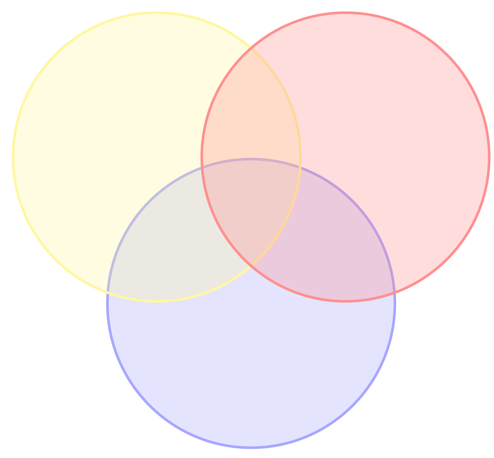

# What is data science?

Data science is often pictured as the intersection of three areas: **computing** (to work with data at scale), **mathematics and statistics** (to draw reliable conclusions), and **domain expertise** (to ask the right questions and interpret results). The Venn diagram below captures this idea where data science sits where all three overlap.

**Data science** is the practice of using data to inform decisions, answer questions, and solve problems. Data is changing how we do science, run businesses, shape policy, and understand the world. From recommendation systems and credit scoring to wildfire modeling and public health. The goal of data science is not to replace human judgment but to support it with evidence. We find this evidence by finding relevant data, recognize its limitations, ask good questions, make reasonable assumptions, conduct appropriate analysis, and synthesize and explain what we learn.

:::{important} Thinking critically about data
Data science is not just running software or applying a statistics recipe. Tools don't do the important thinking. We must question assumptions, assess data quality, interpret results, consider alternative explanations, and reflect on how our decisions affect others. We will discuss the ethics of data science throughout the course.
:::

Data can also be misused! People could obscure complex decisions, reinforce bias, or lend false authority to bad policies through the use of data. Being able to think critically about data empowers you to participate in the arguments that shape your life and society. This course aims to give you that foundation.
