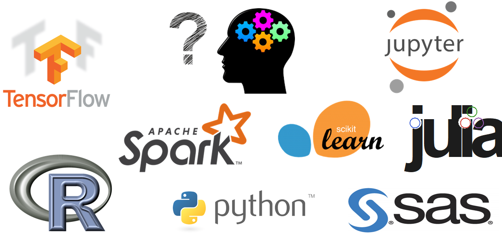

# Why data science matters

The world is complicated and decisions are hard. Data is used everywhere to answer hard questions in science, medicine, social science, engineering, and sports. Claims about data come up in almost every important issue; instead of "so-and-so says," we often hear "the data says." It is usually not easy to tell what the data actually says. Data science enhances critical thinking: it is a human-centered field that helps us balance tradeoffs by finding relevant data, recognizing its limitations, asking the right questions, making reasonable assumptions, conducting appropriate analysis, and synthesizing and explaining our insights. We apply critical thinking and skepticism at every step and consider how our decisions affect others.

The tools we use, whether they are spreadsheets, pandas, or a statistics package... they don't do the important thinking. We do. That idea is worth keeping in mind as you work through the course.

:::{seealso} Ethics and bias
We will return to the ethics of data science and the dangers of opaque or biased use of data in later chapters and discussions.
:::

